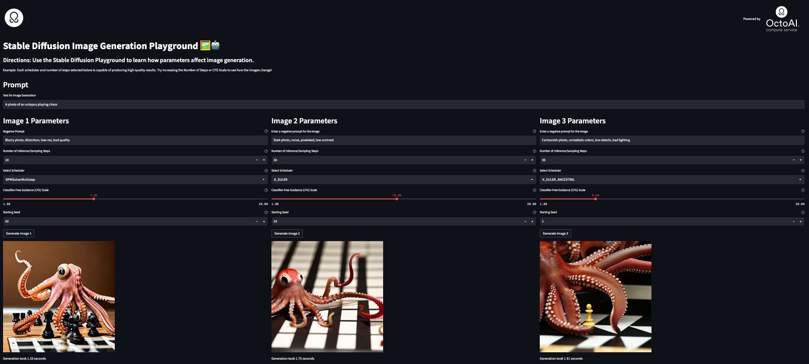
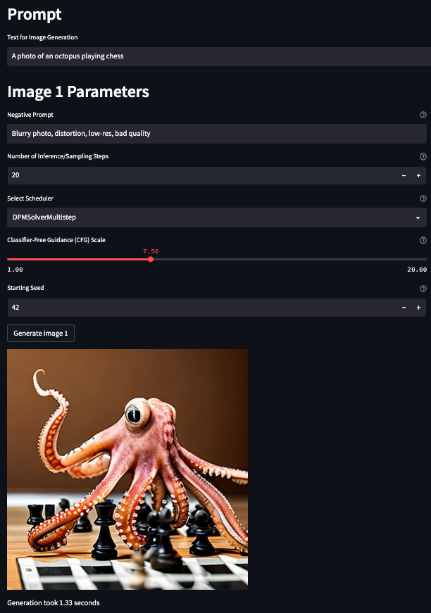

# Stable Diffusion Image Generation Playground Quick Start Guide 🖼️🤖

In this guide, you’ll learn how to build, deploy, and share your own text-to-image Generative AI application just (like this 👇) using OctoAI!

[](https://gregloughnane-octoml-dev-streamlit-app-kd0h8w.streamlit.app/)

Let’s get started!

https://www.loom.com/share/a2009909784e4da6b2f850035785aebd

# Preliminaries

Here are the primary tools that we’ll be using:

- [OctoAI compute service](https://octoai.cloud/): The OctoAI compute service provides fast and simple Machine Learning inference capability for us. In general, it can turn any container or Python code into a production-grade endpoint in minutes.
- [Stable Diffusion 2.1](https://github.com/Stability-AI/StableDiffusion): This is the open-source diffusion model at the core of our text-to-image generation application. We leverage Stable Diffusion directly through OctoAI.
- [Streamlit](https://github.com/streamlit): A tool for building lightweight, beautiful, and shareable Python-based web applications.
- [Miniconda](https://docs.conda.io/en/latest/miniconda.html): A useful package and environment manager that includes both Python and pip out of the box. The standard Python distribution includes each of the following libraries that we’ll leverage in our application:
    - [Requests](https://requests.readthedocs.io/en/latest/): Allows us to send and receive HTTP requests and responses using Python code. We use this library to make it easy to access the OctoML compute service; we simply provide some basic information including the URL and the stable diffusion parameters that we want to send.
    - [Base64](https://docs.python.org/3/library/base64.html#module-base64): Provides the decoding functionality we need to see our generated images for our images after they’re received in an encoded format from the OctoML compute service API.
    - [Time](https://docs.python.org/3/library/time.html): This library is used to time how long it takes to generate each image.

# 🐙 Step 1: Sign up for OctoAI

To use the OctoAI compute service, first sign up for an account and get your credentials and endpoint URL. Here’s how:

- Go to [https://octoai.cloud/](https://octoai.cloud/) and fill out the form with you email and password.  Alternatively, you can leverage your Google or GitHub account directly.
- Check your email for a confirmation link and click on it to activate your account.
- Click `Endpoints` and then `Clone a Quickstart Template`.  Select the `Text2Image Generation` template.
- Feel free to play with the template now to generate images!  To keep building your own production application, scroll to the bottom and click `Ready to use this in production?  Click here`.
- For this demonstration, we will keep all of the defaults the same, including `Endpoint Name`, `Min Replicas`, `Max Replicas`, and `Timeout (sec)`.  We will not enable public access here.
- Click `Clone` .
- Copy your `API Key` and your `Endpoint URL`. You’ll need these later to connect your app to the OctoAI compute service.


# 🧑‍💻 Step 2: Build the application

Now that you have your credentials and endpoint URL, you can build a simple application that uses OctoAI to generate images from text prompts. Here’s what you need to do:

1. `git clone` this repo, download the Python script `streamlit_app.py`, OR create a new file and copy + paste the text from `streamlit_app.py` into it locally on your machine.
2. If you cloned this repo, `cd` into the `stablediffusionapp` folder.
2. Replace `OCTOAI_API_TOKEN` and `ENDPOINT_URL` with your actual API key and endpoint URL that you copied from the dashboard.
3. You can change the default text prompt to anything you want. 
    
    <aside>
    🌃 For example, you can try “A cute kitten playing with a ball of yarn” or “A futuristic cityscape at night”.
    
    </aside>
    

# 💻 Step 3: Create a Virtual Environment & Install Streamlit

- Install the appropriate version of [Miniconda](https://docs.conda.io/en/latest/miniconda.html) for your OS
- From the terminal, create a conda environment using `conda create --name stablediffapp`
- Activate conda environment with `conda activate stablediffapp`
- Install the only library you’ll need using `pip install streamlit`

# 🚢 Step 4: Deploy and run the application!

Now that you have built your application, you can deploy it locally within your conda environment using the pre-built script that we’ve provided. Here’s how:

- Open a terminal window and `cd` into your project folder where `streamlit_app.py` is located
- Run this command: `streamlit run streamlit_app.py`
- Voila! You’re application is working! Try out a few runs!



Screenshot of the completed 3-panel Stable Diffusion Image Generation Playground App, created using Streamlit and the OctoAI Compute Service.



Screenshot of each of the parameters associated with image generation in Stable Diffusion.


# 📚 [OPTIONAL] Step 4: Learn About Stable Diffusion Parameters!

It is important to note that Stable Diffusion operates by first generating a  random image in the latent space of the diffusion model.  The noise predictor estimates the noise within the image, which is then subtracted from the images.  This denoising process is called sampling, and takes place in `sampling steps`.


](images/Denoising.png)

The sampling process responsible for denoising.  Image credit: [https://stable-diffusion-art.com/samplers/](https://stable-diffusion-art.com/samplers/)

The noise **schedule** controls the noise level that is subtracted at each step.  Therefore, the `Scheduler`, taken together with the `Number of Inference/Sampling Steps`, defines the denoising process as a whole.

With that background in mind, let’s take a closer look at each of the five parameters along with some tips for leveraging them to dial-in your Stable Diffusion outputs:

- `Negative Prompt`: Negative prompting allows you to use text prompts to tell Stable Diffusion  what qualities that you do NOT want to appear in your image.
    
    <aside>
    ❎ We provide a few examples in our application including `Blurry photo, distortion, low-res, bad quality`, `Dark photo, noise, pixelated, low contrast`, and `Cartoonish photo, unrealistic colors, low details, bad lighting`. This is the most dynamic parameter, as it is open-ended.
    
    </aside>
    
- `Number of Inference/Sampling Steps`: This controls how many steps the stable diffusion model takes to generate the image from a random noise. The lower the number of steps, the more noise and artifacts will exist.  The higher the number of inference steps, the more refined and realistic the image will be, but also the longer it will take to generate. Your application works with steps from 1 to 500.
    
    <aside>
    ⬆️ Tip: Increase steps when it appears that the quality is low.
    
    </aside>
    
- `Classifier-Free Guidance (CFG) scale`: The higher the Classifier-Free Guidance (CFG) scale, the more the image will match the class of your prompt, but also the less diverse and creative it will be. CFG is a technique that uses a pre-trained feature generator to guide the image generation without relying on a classifier.  Note the effect that increasing or decreasing CFG has on class-specific features such as colors, shapes, and textures.  The range for your application is 1 to 20.
    
    <aside>
    ⬆️ Tip: Increase CFG scale when the image does not seem to follow the prompt.
    
    </aside>
    
- `Scheduler`: Schedulers define the denoising process for Stable Diffusion, and taken together with the `Number of Inference/Sampling steps` the choice indicates a denoising speed versus quality tradeoff.
- There are six options for schedulers, including:
    - PNDM: Pseudo numerical methods for diffusion models ([original implementation](https://github.com/crowsonkb/k-diffusion/blob/481677d114f6ea445aa009cf5bd7a9cdee909e47/k_diffusion/sampling.py#L181))
    - KLMS: Kernel Linear Multistep Scheduler ([paper](https://arxiv.org/abs/1509.01352))
    - DDIM: Denoising Diffusion Implicit Models ([paper](https://arxiv.org/abs/2010.02502))
    - K_EULER: Euler ([references](https://huggingface.co/docs/diffusers/main/en/api/schedulers/euler))
    - K_EULER_ANCESTRAL: Euler Ancestral ([original implementation](https://github.com/crowsonkb/k-diffusion/blob/481677d114f6ea445aa009cf5bd7a9cdee909e47/k_diffusion/sampling.py#L72))
    - DPMSolverMultistep: Diffusion Probabilistic Models ([paper](https://arxiv.org/abs/2206.00927))
    
    <aside>
    🥇 Known high performers when it comes to quality-versus-speed tradeoffs are pre-selected in our Stable Diffusion app, and include:
    
    1. DPMSolverMultistep, 20 steps
    2. K_EULER, 30 steps
    3. K_EULER_ANCESTRAL, 35 steps
    
    </aside>
    
- `seed`: This controls the randomness of the image generation. The seed is a number that determines how the random noise is initialized. Different seeds will produce different images for the same prompt and parameters.
    
    <aside>
    🌱 Tip: Use the same seed to dial in your parameters for a particular image generation task!
    
    </aside>
    

Now it’s time to run your application and see what amazing images OctoML can generate for you as you play with each of the five core parameters. 

# 🚀 [OPTIONAL] Step 5: Sharing Your App with Your Team!

Sharing your Streamlit app is really easy to do, including directly through the embedded GitHub badge like we’ve done at the top of this repo!

Follow [this tutorial](https://docs.streamlit.io/streamlit-community-cloud/get-started/share-your-app) to deploy the app on the Streamlit cloud, and then simply add this line of code to your GitHub README.md

```python
[](https://<your-custom-subdomain>.streamlit.app)
```

<aside>
❗ Be sure to replace `https://<your-custom-subdomain>.streamlit.app` with the URL of your deployed app!

</aside>

# Conclusion

Congratulations! You have successfully build, shipped, and shared a production Stable Diffusion app to generate realist images from text prompts!

You also learned all about Stable Diffusion and the OctoAI compute services along the way.

Check out the other templates available in OctoAI. Now any Generative AI app you want to build is just a few clicks and lines of code away!

We hope you enjoyed this quick-start guide. Thank you for using OctoAI!

For a deep-dive on exactly what is in the application code, we’ve outlined each core piece, step-by-step, below for your reference.

# ⌨️ Step-by-Step Code Breakdown

Now, we’ll walk through all of the core components of a simple Stable Diffusion Application, step-by-step.  In this appendix, you’ll learn:

1. What the core libraries are for
2. Streamlit syntax for creating various page elements and input types including text and number inputs, select boxes, and sliders.
3. How easy it leverage OctoAI with simple definitions of the `url` and `payload`. 

## 1. Install Dependencies

`requests` is necessary for calling the OctoAI API.  `streamlit` is for our front end application, and `base64` is required to decode the generated image returned by OctoAI.

```python
import requests
import streamlit as st
import base64
```

## 2. Set Up Streamlit App

## 2.1. Title & Description

This section adds a title and description for our Image Generation Playground.

```python
st.title("Stable Diffusion Image Generation Playground 🖼️🤖")
st.subheader("Directions: Use the Stable Diffusion Playground to learn how parameters affect image generation.")
```

## 2.2. Prompt Input

This is where the user creates the prompt for image generation!  We fill in the input box with the default text of `"A photo of an octopus playing chess"`

```python
st.header("Prompt")
prompt = st.text_input("Text for Image Generation", "A photo of an octopus playing chess")
```

## 3. Stable Diffusion API Call via OctoAI

**This is the core of the application**.  It includes the following steps:

- Collecting user inputs for Stable Diffusion parameters
- Defining URL and Stable Diffusion parameters
- Consuming the API directly through the OctoAI
- Decoding the API response so that we can view our generated image!

## 3.1. Collect Stable Diffusion Parameter Inputs

First, five Stable Diffusion parameter inputs are collected and passed through to the OctoAI compute service.  These include `negative_prompt`, `num_inference_steps`, `scheduler`, `guidance_scale`, and `seed`.

```python
negative_prompt = st.text_input("Negative Prompt", "Blurry photo, distortion, low-res, bad quality", help="Use negative prompts to specify image characteristics that represent the opposite of the output that you want.")
num_inference_steps = st.number_input("Number of Inference/Sampling Steps", 1, 500, 20, help="Increase steps when you believe the quality is low.")
scheduler = st.selectbox("Select Scheduler", ["PNDM", "KLMS", "DDIM", "K_EULER", "K_EULER_ANCESTRAL", "DPMSolverMultistep"], index=5, help="Schedulers define the denoising process for stable diffusion, and taken together with the number of inference steps the choice indicates a denoising speed versus quality tradeoff.")
guidance_scale = st.slider("Classifier-Free Guidance (CFG) Scale", 1.0, 20.0, 7.5, help="Increase CFG scale when the generated image does not follow the prompt.")
seed = st.number_input("Starting Seed", min_value=0, value=42, help="Initialize generations with the same starting seed for more reproducible images")
```

## 3.2. Define URL and Stable Diffusion Parameters for OctoAI

Next, upon clicking the “Generate Image” button, the URL to OctoAI’s compute service is defined, and the parameters are set up in JSON format to be passed through to the API.

```python
if st.button("Generate Image"):
    endpoint_url = "https://stable-diffusion-demo-kk0powt97tmb.octoai.cloud/predict"
    payload  = {
        "prompt": prompt,
        "negative_prompt": negative_prompt,
        "guidance_scale": guidance_scale,
        "num_inference_steps": num_inference_steps,
        "solver": scheduler,
        "seed": seed
    }
```

## 3.3. Calling OctoAI’s Compute Service

Consuming the API is as simple as sending a `POST` command to the pre-defined `url` with the parameters defined within the `payload`.  The timer here serves only as a way to measure the time for each image generation.

```python
response = requests.post(endpoint_url, json=payload)
```

## 3.4. Decoding and Displaying the Generated Image

Following the API call to OctoAI, the image can be extracted from the response.  In order to view the encoded image that is returned, it must first be decoded.  The image is then displayed directly within the app.

Note that `image_0` is syntax that is required for use with the [Demo version of OctoAI’s Text2Image Generation](https://octoai.cloud/templates/stable-diffusion-demo).

```python
image_data = response.json()["image_0"]
with open("image.png", "wb") as f:
    f.write(base64.b64decode(image_data))
st.image("image.png")
```

Congratulations!  Now you understand the core components required to build a simple Stable Diffusion Application using OctoAI and Streamlit!

# 📚 Next Steps
If you have any questions or comments, please check our [docs](https://docs.octoai.cloud/docs) or reach out and ask a question directly in our [discord community](https://discord.com/invite/rXTPeRBcG7)!  We look forward to seeing what you build next!

Thanks for using OctoAI!